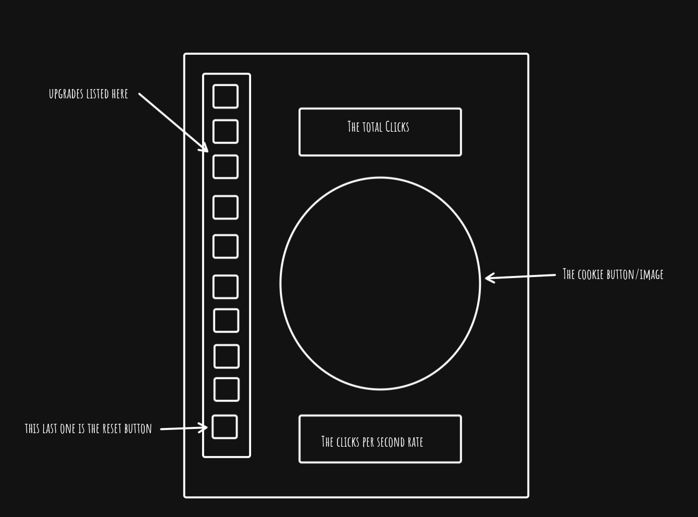

# Week-03-assignment

Create a cookie clicker game

Building the project, spent a time figuring out 'thePlan.txt' placed in the misc folder, this is my starting point to reference as I proceed, and as I get a little lost in details.

First up the wireframe: 

my plan is to use the same layout for desktop and center it on the screen, I need the CSS practice!
I will start with no styling and just get the game working, then add the styling.

---

Basic framework completed, Not used branches for the task, forgot, will play with branches outside the assignment later

---

checkpoint 2: I have managed to add buttons matching the returned upgrades from the API, I have configured the buttons ID to match the upgrades ID and use the same callback function passing the event, then logging to console within that function the ID of the calling button.
all happy at the moment, not sure I'm doing the buttons call back correctly, I am calling an anon function that just calls my function passing the event, this seems a bit ungainly, I have a feeling that I should just be calling 'my' callback function and skipping the anon part altogether.

I'll push my assignment now with the message checkpoint2

---

Checkpoint 3: 2025 05 0943
I now have a functioning app with no styling and no local save feature.
all going well nearly started researching favicon just to remove the warning kicked out by firefox dev tools, but keeping on track...

---
